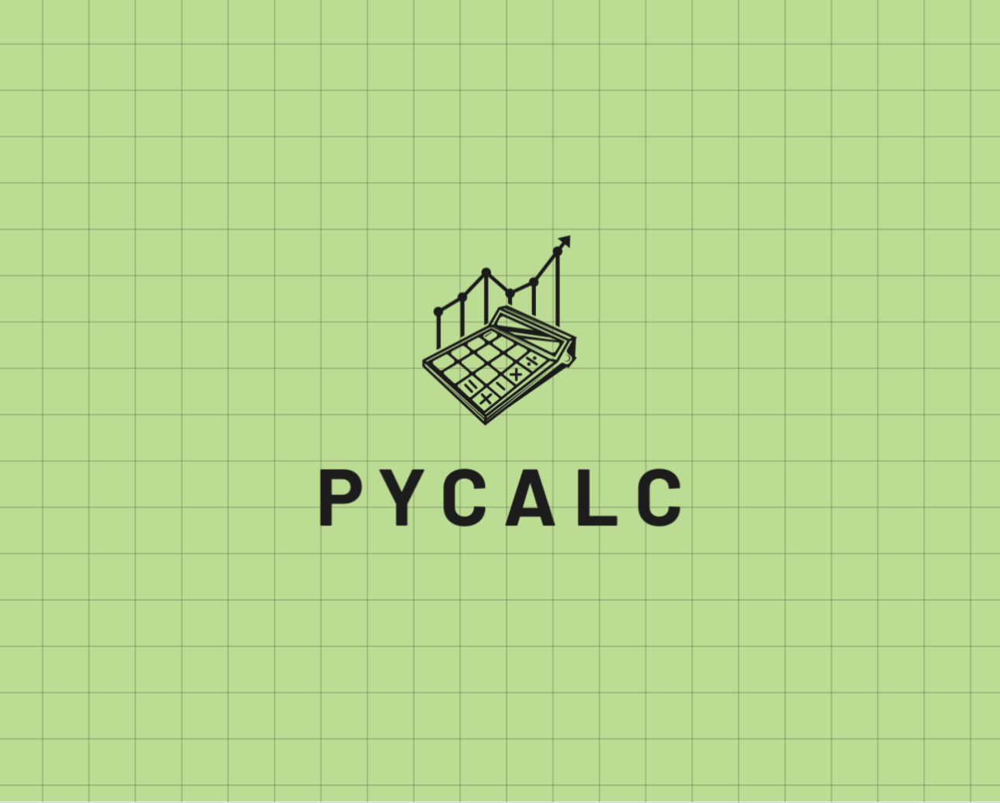

# PyCalc

PYCALC is a simple calculator application built using Streamlit. It allows users to perform basic arithmetic operations through a chat-like interface.



## FEATURE 
- Supports addition, subtraction, multiplication, and division operations
- Handles decimal numbers and negative numbers
- Provides a chat-like interface for calculations
- Maintains a history of calculations within the session

## GETTING STARTED
Git clone the repository or fork it as you like
```bash
    git clone <http-link>
```
```bash
    cd PYCALC
```
Installation of the required packages/modules 
```bash
    pip install requirements.txt
```
Running the application locally
```bash
    streamlit run PyCalc.py
```
## BADGES

[](https://choosealicense.com/licenses/mit/)

